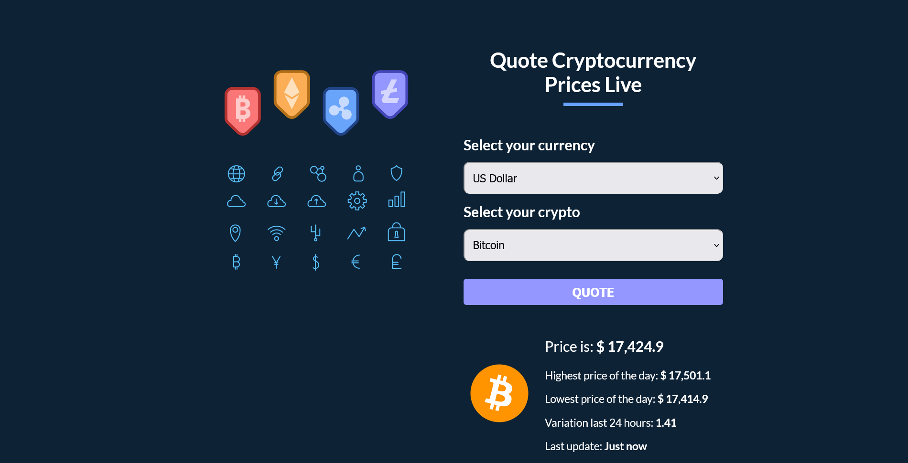

# Chat App
Worked with another frontend devloper to create this chat app. Built with reactjs, styled components and api.

**Link to project:** visionary-maamoul-ea8963.netlify.app

## How It's Made:

**Tech used:** Reactjs, Styled Components and API

## Examples:
Take a look at these couple examples that I have in my own portfolio:

**Crypto-Price-App:** https://github.com/coded-zeus/chat-app

**Voice Controlled News App:** https://github.com/coded-zeus/vice-controlled-app

**Fiverr Clone:** https://github.com/coded-zeus/fiverr-clone
